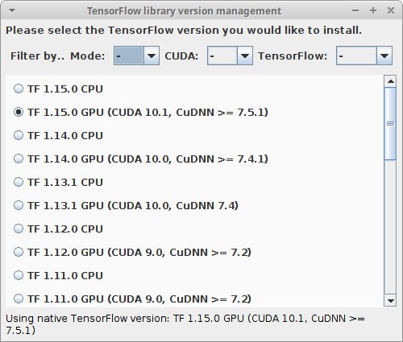

<b>The notes on this page are relevant for any tool shipping the `imagej-tensorflow` library (e.g. the update sites `imagej-tensorflow` and `CSBDeep`).</b>

How to install TensorFlow GPU native libraries
----------------------------------------------

GPU support is available for Linux and Windows machines with NVIDIA graphics cards. Please be warned that the TensorFlow Java native bindings are considered experimental and while some hardware / OS setups easily gained GPU support with the tools described on this page, on other machines we were not successful.

### 1. Install TensorFlow with GPU support for Java

1.  Open `Edit > Options > TensorFlow...`
2.  Choose the TensorFlow version matching your system
3.  Wait until the library is downloaded and installed (a popup will tell you when it’s done)
4.  Restart Fiji

You can for example switch from CPU to GPU by finding the option which is already selected (in the screenshot, `TF 1.15.0 CPU`) and choose the same TensorFlow version but with GPU support (e.g. `TF 1.15.0 GPU`).

### 2. Install the CUDA® Toolkit and cuDNN

Install these NVIDIA requirements to run TensorFlow with GPU support as described in the [TensorFlow Documentation](https://www.tensorflow.org/install/gpu).

#### Which specific CUDA and cuDNN versions to install?

The CUDA and CuDNN versions displayed in the ImageJ TensorFlow installer (pictured above) are there to help you setup the right environment.

Example: The `CSBDeep` update site comes with `TensorFlow 1.16.0`, which requires `CUDA 10.1` and `cuDNN >= 7.5.1`.

You can also use the filters on the top of the display to filter for a specific TensorFlow or CUDA version or to only list libraries with GPU support.

<b>Note: If you trained your model on a different TensorFlow version, running the model with with the default installation might fail. In this case, choose a specific TensorFlow version via `Edit > Options > TensorFlow...` and install CUDA and cuDNN compatible to the TensorFlow version.</b>

### 3. How to check if GPU support works

-   Go to `Edit > Options > TensorFlow...` and make sure a GPU version is selected an no error is displayed
-   When running a command using `imagej-tensorflow`, you can open the console via `Window > Console`. There might be a line similar to this (in this example, no GPU version manually installed and therefore the default CPU TensorFlow version is used):

<code>

    [INFO] No TF library found in /media/data/Programs/Fiji.app/lib/.
    [INFO] Using default TensorFlow version from JAR: TF 1.15.0 CPU

</code>

-   Sometimes that's still not sufficient and even though the right library is chosen and the console confirms that, the GPU is not used. Please read the notes for the specific operating systems below.

-----------------

### 3.1 Hints for Windows

#### Step-by-step example

Here is a step-by-step example of a successful GPU support installation:

-   Install the most recent Nvidia driver for your system as described [here](https://docs.nvidia.com/deeplearning/cudnn/install-guide/index.html#installdriver)
-   in Fiji, opened `Edit > Options > TensorFlow...` and switched to TF 1.15.0 GPU
-   Installed `CUDA 10.1` from [here](https://developer.nvidia.com/cuda-10.1-download-archive-base?target_os=Windows&target_arch=x86_64&target_version=10&target_type=exenetwork)
-   Downloaded `cuDNN 7.6.5 for CUDA 10.1` from [here](https://developer.nvidia.com/rdp/form/cudnn-download-survey) (you need to register / login)
-   copied cuDNN files from the ZIP into CUDA as described [here](https://docs.nvidia.com/deeplearning/sdk/cudnn-install/index.html#installwindows)
-   add `/PATH/TO/Fiji.app/lib/win64/tensorflow_jni.dll` to your `PATH` (here’s a guide [how to set system variables](https://www.techjunkie.com/environment-variables-windows-10/))

The variables you should have set are these two. Normally, CUDA does that for you when you install it.

As well as the following additions to your PATH system-variable.

### 3.2 Hints for Linux

#### Step-by-step example

-   Install the most recent Nvidia driver for your system as described [here](https://docs.nvidia.com/deeplearning/cudnn/install-guide/index.html#installdriver)
-   in Fiji, opened `Edit > Options > TensorFlow...` and switched to TF 1.15.0 GPU
-   Installed `CUDA 10.1` from [here](https://developer.nvidia.com/cuda-10.1-download-archive-base?target_os=Linux) Select the linux version you use.
-   Downloaded `cuDNN 7.6.5 for CUDA 10.1` from [here](https://developer.nvidia.com/rdp/cudnn-archive) (you need to register / login) Again, pick the version for your system from the archive, default to Linux.
-   copied cuDNN files from the ZIP into CUDA as described [here](https://docs.nvidia.com/deeplearning/cudnn/install-guide/index.html#installlinux)

#### Set the library path

`CUDA` and `cuDNN` need to be added to your system variables in order for Fiji to be able to use them. You can do that by adding lines similar to this to your `.bashrc` or `.zshrc` file:

    export PATH=/usr/local/cuda/bin${PATH}
    export LD_LIBRARY_PATH=/usr/local/cuda/lib64:${LD_LIBRARY_PATH}

.. and then launch Fiji from command line. Another possibility is to edit the Fiji launcher to something like this:

    export PATH=/usr/local/cuda/bin${PATH};export LD_LIBRARY_PATH=/usr/local/cuda/lib64:${LD_LIBRARY_PATH};/PATH_TO_APPS/Fiji.app/ImageJ-linux64

#### Multiple GPUs

If you have multiple CUDA enabled GPUs you may want to set the environment variable `CUDA_VISIBLE_DEVICES` to specify the GPU which should be used.

As CUDA will try to enumerate the GPUs by speed

    $ export CUDA_VISIBLE_DEVICES=0

should give you only the fastest GPU. Execute this line before you start Fiji or put it into your `~/.bashrc` or set the environment variable somewhere else like in `~/.pam_environment`. See the documentation of your distribution for options on how to set environment variables.

**Optional:**

If this is not sufficient for your setup. You can find out the ID (in PCI bus order) of your GPU with:

    $ nvidia-smi
    Thu Sep 14 17:39:33 2017       
    +-----------------------------------------------------------------------------+
    | NVIDIA-SMI 375.66                 Driver Version: 375.66                    |
    |-------------------------------+----------------------+----------------------+
    | GPU  Name        Persistence-M| Bus-Id        Disp.A | Volatile Uncorr. ECC |
    | Fan  Temp  Perf  Pwr:Usage/Cap|         Memory-Usage | GPU-Util  Compute M. |
    |===============================+======================+======================|
    |   0  NVS 310             Off  | 0000:A1:00.0     N/A |                  N/A |
    | 30%   56C    P0    N/A /  N/A |    294MiB /   961MiB |     N/A      Default |
    +-------------------------------+----------------------+----------------------+
    |   1  TITAN Xp            Off  | 0000:03:00.0     Off |                  N/A |
    | 23%   28C    P8     9W / 250W |      1MiB / 12189MiB |      0%      Default |
    +-------------------------------+----------------------+----------------------+

and also set the environment variable `CUDA_​DEVICE_​ORDER`:

    $ export CUDA_​DEVICE_​ORDER=&quot;PCI_BUS_ID&quot;
    $ export CUDA_VISIBLE_DEVICES=1

See the [CUDA Programming Guide](http://docs.nvidia.com/cuda/cuda-c-programming-guide/index.html#env-vars) for more information.

HELP
----

Is something not working? Please post your question [in the forum](https://forum.image.sc)!
